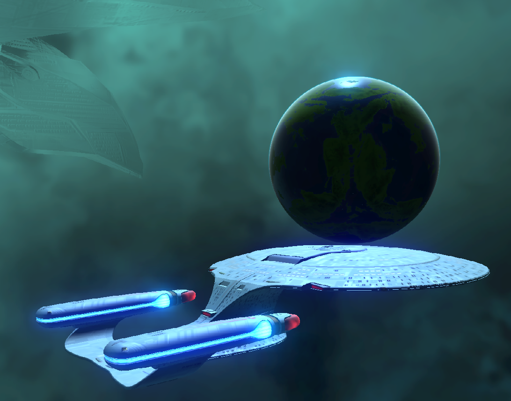

# WebGL-Renderer
3D renderer which has implementations of 3D fluid simulation, pbr shading, deferred rendering and other using WebGL2

## PBR example
Utah teapot example models rendered with pbr shader and a transparent glass shader

## Fluidsim 3D example
Interactive fluid simulation

## Star Trek scene example
Example using deferred rendering with pbr shading for the Enterprise and the planet. Work still in progres.

*The Enterprise and the cloaked Romulan ship are not owned by me*

